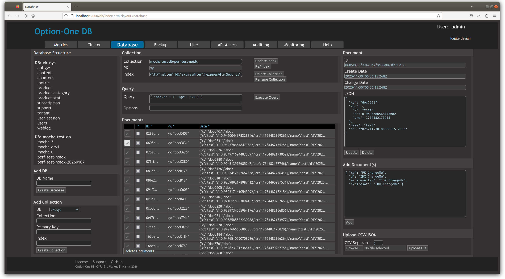

# Option One DB JS SDK

Option One DB is the next generation open source JSON document database with built in AI search:
- **Fast** and **light weight** (startup RAM: ca. 30 MB)
- **Scales horizontally**
  ... but runs as single server on a laptop ... or even a Raspberry Pi
- Optimized to run in a container and **Kubernetes**
- **Powerful indexing and query** engine + use LLM to create embedding indexes for **AI search**
- Manage (binary) **attachments** for documents
- Simple user and **API** access management
- Built in **backup scheduler**
- Integrated **GUI** for administration, monitoring and data management

 

Status: EXPERIMENTAL -- use at your own risk!!

This JS SDK is a wrapper for the Option One DB REST API.

Example:

```JS 
const { DbClient } = require( 'option-one-db' )
const dbCredentials = { 
  accessId: process.env.DB_ACCESS_ID
  accessKey: process.env.DB_ACCESS_KEY
} 
const client = new DbClient( process.env.DB_URL, dbCredentials )
await client.connect()
const db = await client.db( 'test-db' )
let myAwesomeDocs = await db.collection( 'my-awesome-docs' )
let cursor = myAwesomeDocs.find({ name: 'Moe' })
let docArray = await cursor.toArray()
for ( let doc of docArray ) {
  console.log( doc )
}
```

Details: See [API reference](README-SDK.md) 

## Use AI search

Example: Create AI index with a LLM embedding for the field `productDescription` in the product collection:

```JS
await productCollection.createIndex(
  'productDescription',
  { AI: 'embedding-gemma' }
)
```

Add documents to the collection with text in `productDescription` field ...

Query using AI:

```JS
let cursor = productCollection.find({ 
  productDescription: { 
    "$ai": "Show me fancy products suitable for premium customers!"
}}
let docArray = await cursor.toArray()
...
```

## Start a single server DB

Run the  [Option One DB](https://github.com/ma-ha/option-one-db/) server locally as docker container:

    docker run -d --name option_one_db  -p 9000:9000  -e DB_POD_NAME='my-db' -v /home/my-user/db/:/option-one/db/ -v /home/my-user/backup:/option-one/backup/ mahade70/option-one-db:0.14-single

(This creates the folder `/home/my-user/db` and `/home/my-user/backup` if they are not existing.)

Get the user and password from the startup logs:

    docker logs option_one_db

Open http://localhost:9000/db and log in.

Check out the GitLab repo how to run the server as NodeJS process without docker.

## Start a DB cluster in Kubernetes

Option One DB embraces Kubernetes. Setup is easy and done in some minutes.

Step by step instruction, see https://github.com/ma-ha/option-one-db/
